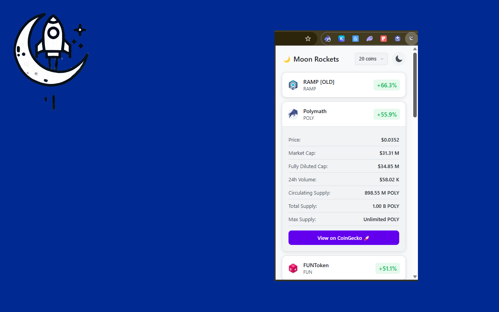

# 🚀 To The Moon!

A Chrome extension that shows the top cryptocurrency gainers in the last 24 hours with a beautiful, modern UI.


## Screenshots

<p align="center">
  
  
</p>

## Features

- 📈 Real-time tracking of top crypto gainers
- 🌗 Light and Dark themes with beautiful UI
- 📱 **Side Panel Support** - Extended view with pinning option
- 🔢 Customizable number of coins to display (5-50 in side panel)
- 🦎 **CoinGecko Integration** - Comprehensive market data
- 🟡 **Binance API Support** - Real-time trading data with sorting options
- 📑 **Tab-based Interface** - Switch between different data sources
- 💫 Clean and intuitive interface
- 🔄 Auto-updates every 3 minutes
- 📊 Detailed coin information including:
  - Price and price changes
  - Market Cap & Volume
  - Supply metrics
  - Trading data (Binance)
  - Direct links to exchanges

## Installation

### From Chrome Web Store
*[Link](https://chromewebstore.google.com/detail/%F0%9F%9A%80-to-the-moon/aepcdjhplhadhedgoejeccologmjbghc?authuser=0&hl=en)*

### Manual Installation
1. Clone this repository
2. Open Chrome and navigate to `chrome://extensions/`
3. Enable "Developer mode" in the top right
4. Click "Load unpacked" and select the extension directory

## Development

The extension is built using vanilla JavaScript and uses the CoinGecko API for cryptocurrency data.

### Project Structure 
```
extension/
├── manifest.json
├── assets/ (icons and promotional images)
├── popup/ (main popup interface)
│   ├── popup.html
│   ├── popup.css
│   └── popup.js
└── sidepanel/ (extended side panel interface)
    ├── sidepanel.html
    ├── sidepanel.css
    └── sidepanel.js
```

### APIs
- **CoinGecko API**: Comprehensive cryptocurrency market data
- **Binance API**: Real-time trading data and 24h statistics

## Contributing
Pull requests are welcome. For major changes, please open an issue first to discuss what you would like to change.

## License
[MIT](https://choosealicense.com/licenses/mit/)

## Author
- Website: [lab.maxbasev.com](https://lab.maxbasev.com)
- GitHub: [@MaxBasev](https://github.com/MaxBasev)
- Blog: [en.skazoff.com](https://en.skazoff.com)
