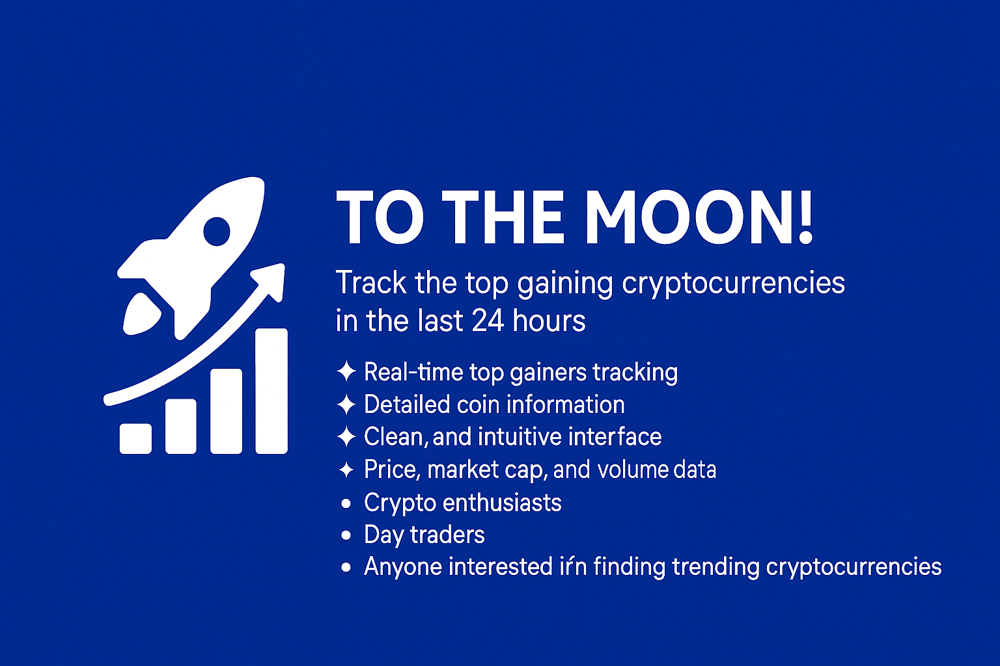
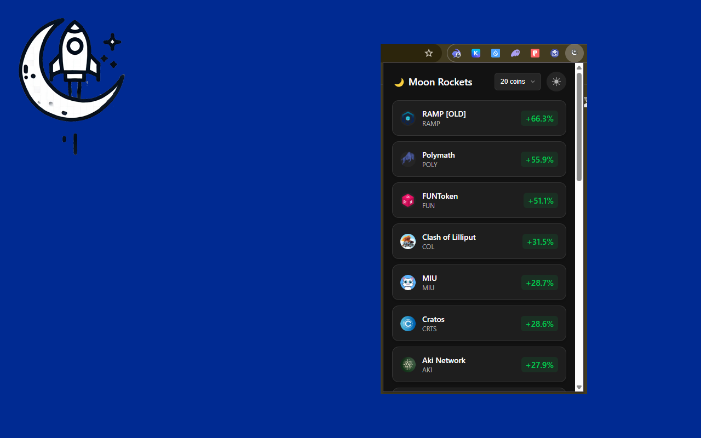
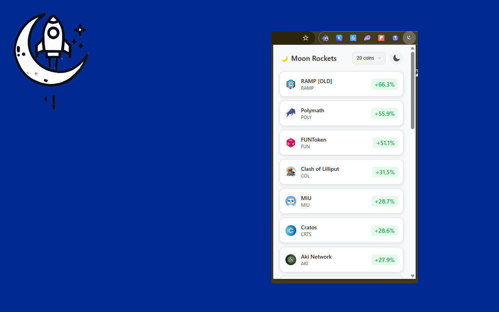

# 🚀 To The Moon!

A Chrome extension that shows the top cryptocurrency gainers in the last 24 hours with a beautiful, modern UI.



## Screenshots

<p align="center">
  
  
</p>

## Features

- 📈 Real-time tracking of top crypto gainers
- 🌗 Light and Dark themes with beautiful UI
- 🔢 Customizable number of coins to display (5, 10, 15, or 20)
- 💫 Clean and intuitive interface
- 🔄 Auto-updates every 3 minutes
- 📊 Detailed coin information including:
  - Price
  - Market Cap
  - Volume
  - Supply metrics
  - Price change percentage

## Installation

### From Chrome Web Store
*[Link](https://chromewebstore.google.com/detail/%F0%9F%9A%80-to-the-moon/aepcdjhplhadhedgoejeccologmjbghc?authuser=0&hl=en)*

### Manual Installation
1. Clone this repository
2. Open Chrome and navigate to `chrome://extensions/`
3. Enable "Developer mode" in the top right
4. Click "Load unpacked" and select the extension directory

## Development

The extension is built using vanilla JavaScript and uses the CoinGecko API for cryptocurrency data.

### Project Structure 
```
extension/
├── manifest.json
├── assets/
│   ├── icon16.png
│   ├── icon32.png
│   ├── icon48.png
│   ├── icon64.png
│   ├── icon128.png
│   └── icon256.png
└── popup/
    ├── popup.html
    ├── popup.css
    └── popup.js
```

### API
Data is provided by the [CoinGecko API](https://www.coingecko.com/en/api)

## Contributing
Pull requests are welcome. For major changes, please open an issue first to discuss what you would like to change.

## License
[MIT](https://choosealicense.com/licenses/mit/)

## Author
- Website: [maxbasev.com](https://maxbasev.com)
- GitHub: [@MaxBasev](https://github.com/MaxBasev)
- Blog: [en.skazoff.com](https://en.skazoff.com)
